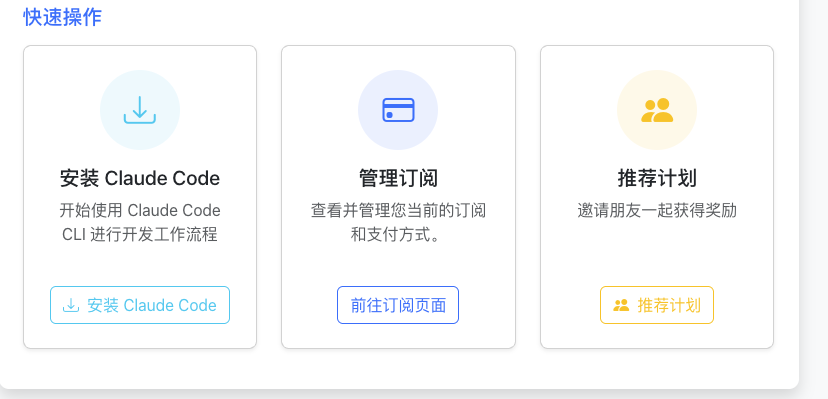
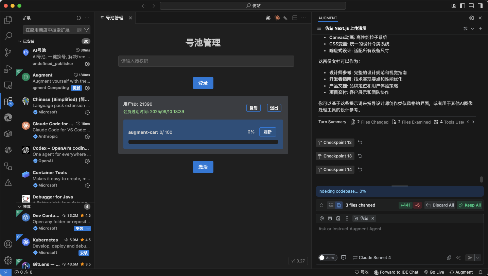
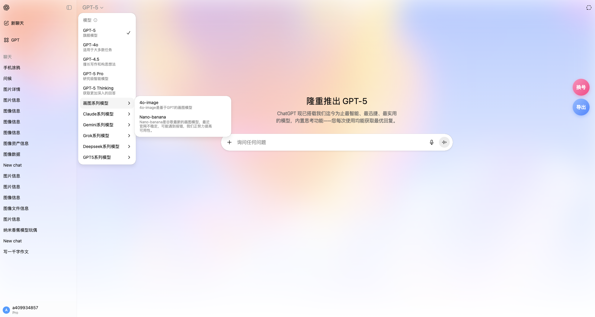

## 简介

本仓库整理了 **ChatGPT 镜像站、ClaudeCode 镜像、Augment 续杯** 的详细使用指南，支持 GPT-5、Claude 4、Deepseek、Gemini、Grok 等大模型。解决 ChatGPT Plus 购买难题，支持文件上传、图片识别、代码解释等功能，无需科学上网即可使用。价格更便宜，体验与官网一致，是学习、开发、科研和日常使用的最佳方案。

## 1. ClaudeCode 镜像站

**ClaudeCode 镜像**是为开发者和代码工作者打造的镜像方案，支持 **Claude 系列大模型** 的全部功能：  
- 无缝编程对话  
- 代码解释与调试  
- 大文件阅读和总结  

**使用优势**  
- 不存在封号风险：购买多久就能使用多久  
- 登录即用，无需额外配置  
- 体验与官网一致，Claude 在 IDE 和大文档场景下优势明显  

详细使用教程可参考：[ClaudeCode 镜像指南](https://blog.ai4.plus/posts/2025/claude-code-mirror-guide-cn/)

---

## 2. Augment 续杯

**Augment 续杯** 是针对 **无法绑卡的用户** 的需求，核心卖点是：  
- **自动续杯**：即使账号到期，也能无缝切换到新账号  
- **无限制体验**：每天一百次使用次数  
- **性价比高**：比官方50刀 更便宜

详细使用教程可参考：[Augment 续杯全攻略](https://blog.ai4.plus/posts/2025/augmentcode-unlimited-guide-cn/)

---

## 3. ChatGPT 镜像站

ChatGPT 镜像站是目前最受欢迎的方式之一，具备以下特征：  
- **无需科学上网**：直接访问即可使用  
- **多账号切换**：提供几百个plus账号，随便切换  
- **功能全覆盖**：GPTs、自定义助手、上传文件、图片识别、代码解释器等全部功能可用  
- **高速稳定**：接入 Deepseek、Gemini、Grok 等新模型，响应快、负载稳  

**核心优势**  
- 不存在封号风险  
- 支持最新大模型接入  
- 售后可咨询客服，随时了解可用模型  

---

## 4. 使用速度对比与体验

实测体验表明：  
- **ChatGPT 镜像站** 与官方使用几乎没有差别  
- **Claude 镜像站** 在长文档与代码任务中更强大  
- **Augment 续杯** 提供了持久稳定的账号体系，避免反复购买  

无论是开发者、内容创作者，还是日常学习用户，都可以在镜像站找到合适的解决方案。

---

## 5. 总结

如果你还在困惑：  
- **GPT-5 怎么购买？**  
- **OpenAI 支付不出去怎么办？**  
- **Claude code 怎么使用？**  

那么，现在的最优解就是 —— **使用第三方提供的服务**。  

👉 点击直达：[https://kk4099.com/](https://kk4099.com/)  

价格更低，使用更稳，无需担心封号，让你持续畅享 **ChatGPT、Claude、Deepseek、Gemini、Grok** 等顶级 AI 模型。
